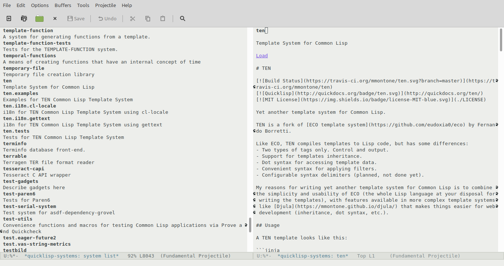

# quicklisp-systems

Search, browse and load Quicklisp systems from Emacs.



## Install

ℹ️ Please consider using [SLIME :star:](https://github.com/mmontone/slime-star), that comes with this extension preinstalled.

Load `swank` and add this repository path to `swank::*load-path*`, in your Lisp compiler init file (~/.sbclrc if using SBCL):

```lisp
(require :swank)
(push #p"/home/marian/src/lisp/quicklisp-systems/" swank::*load-path*)
```

In Emacs, add this repository path to `load-path` and add `quicklisp-systems` to `slime-contribs` in `~/.emacs` init file, like:

```
(push "/home/marian/src/lisp/quicklisp-systems" load-path)

(setq slime-contribs '(slime-fancy quicklisp-systems))

(slime-setup)
```

## Use

- `M-x quicklisp-systems-list`: browse the list of Quicklisp systems.
- `M-x quicklisp-systems-apropos`: search both by name and in system descriptions.
- `M-x quicklisp-systems-apropos-name`: search systems by name.
- `M-x quicklisp-systems-apropos-author`: search systems by author.
- `M-x quicklisp-systems-show-system`: show an Emacs buffer with information about the Quicklisp system.
- `M-x quickload`: Load a Quicklisp system.
- `M-x quicklisp-systems-update`: update the list of Quicklisp systems (this extension downloads a "systems file" with information of ASDF systems in Quicklisp to operate).

Use `q` to kill individual buffers, and `Q` to kill all quicklisp-systems buffers at once.

## Quicksearch

This repository also contains a simple Emacs frontend for `quicksearch`, that searches for Quicklisp packages on the internet.

It is available on Quicklisp: `(ql:quickload :quicksearch)`.

Just load [quicksearch.el](quicksearch.el) in your Emacs, and then use `M-x quicksearch` Emacs command to trigger a search.

## License

GPL
